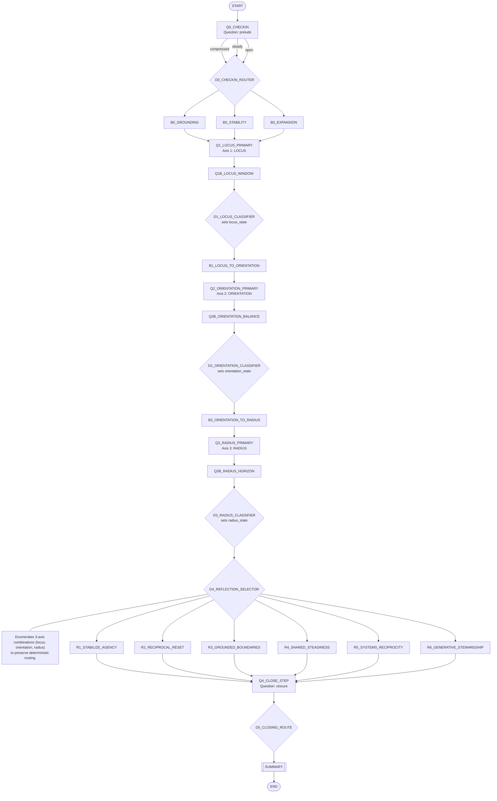

# TriLens Tree Diagram

Traversal is fixed and deterministic.  
Axis order is preserved as `locus -> orientation -> radius`, with bridge/decision nodes providing explicit, auditable routing.

## Complex Node Notes

- `D1_LOCUS_CLASSIFIER`: normalizes two locus answers into one `locus_state`.
- `D2_ORIENTATION_CLASSIFIER`: normalizes two orientation answers into one `orientation_state`.
- `D3_RADIUS_CLASSIFIER`: normalizes scope+horizon into one `radius_state`.
- `D4_REFLECTION_SELECTOR`: central lookup that maps the normalized axis triple to exactly one reflection node (`R1`..`R6`).
