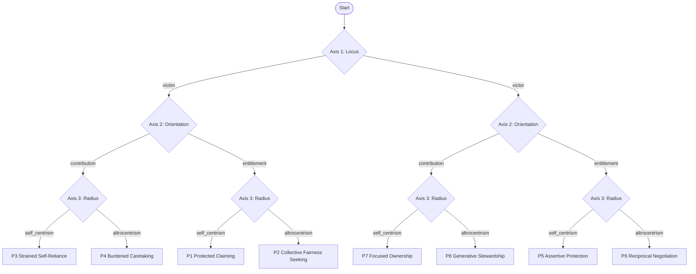

# TriLens Reflection Tree Diagram

```mermaid
flowchart TD
    S([Start]) --> Q1{Axis 1: Locus}
    Q1 -->|victim| Q2V{Axis 2: Orientation}
    Q1 -->|victor| Q2R{Axis 2: Orientation}

    Q2V -->|contribution| Q3VC{Axis 3: Radius}
    Q2V -->|entitlement| Q3VE{Axis 3: Radius}
    Q2R -->|contribution| Q3RC{Axis 3: Radius}
    Q2R -->|entitlement| Q3RE{Axis 3: Radius}

    Q3VC -->|self_centrism| P3[P3 Strained Self-Reliance]
    Q3VC -->|altrocentrism| P4[P4 Burdened Caretaking]
    Q3VE -->|self_centrism| P1[P1 Protected Claiming]
    Q3VE -->|altrocentrism| P2[P2 Collective Fairness Seeking]
    Q3RC -->|self_centrism| P7[P7 Focused Ownership]
    Q3RC -->|altrocentrism| P8[P8 Generative Stewardship]
    Q3RE -->|self_centrism| P5[P5 Assertive Protection]
    Q3RE -->|altrocentrism| P6[P6 Reciprocal Negotiation]
```

The traversal order is fixed: Locus -> Orientation -> Radius.  
Each complete path maps to exactly one profile.
